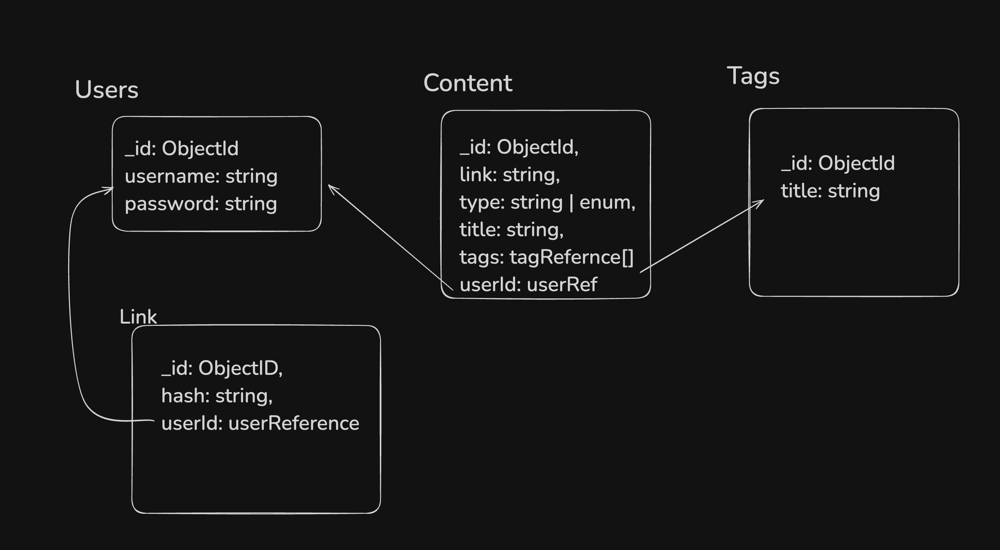

# Thought Garden

A full-stack REST API for saving and sharing content (articles, tweets, YouTube videos, links) with tagging support. Users can manage their personal "brain" - a collection of useful content - and optionally share it with others.

## Tech Stack

- **Runtime:** Node.js
- **Language:** TypeScript
- **Framework:** Express.js
- **Database:** MongoDB with Mongoose
- **Authentication:** JWT + bcryptjs
- **Validation:** Zod

## Project Structure

```
thought-garden/
├── assets/
│   └── schema-design.png       # Database schema diagram
├── src/
│   ├── schema/
│   │   └── db.ts               # Mongoose schemas & models
│   ├── controllers/
│   │   ├── auth-controller.ts  # Authentication logic
│   │   ├── content-controller.ts # Content CRUD operations
│   │   └── brain-controller.ts # Brain sharing logic
│   ├── routes/
│   │   ├── auth-routes.ts      # Auth endpoints
│   │   ├── content-routes.ts  # Content endpoints
│   │   └── brain-routes.ts     # Brain sharing endpoints
│   ├── middleware/
│   │   └── user-middleware.ts # JWT verification
│   ├── validations/
│   │   └── user-validation.ts # Zod validation schemas
│   └── index.ts                # Entry point
├── .env                        # Environment variables
├── package.json
└── tsconfig.json
```

## Database Schema



## API Endpoints

### Auth Routes (`/api/v1`)

| Method | Endpoint | Description | Auth Required |
|--------|----------|-------------|---------------|
| POST | `/signup` | Register a new user | No |
| POST | `/signin` | Login user, returns JWT | No |

### Content Routes (`/api/v1/content`)

| Method | Endpoint | Description | Auth Required |
|--------|----------|-------------|---------------|
| POST | `/` | Add new content | Yes |
| GET | `/` | Get all user's content | Yes |
| DELETE | `/` | Delete content by ID | Yes |

### Brain Routes (`/api/v1/brain`)

| Method | Endpoint | Description | Auth Required |
|--------|----------|-------------|---------------|
| POST | `/share` | Enable/disable brain sharing | Yes |
| GET | `/:shareLink` | View shared brain | No |

## Getting Started

### Prerequisites

- Node.js (v14+)
- MongoDB (local or Atlas)

### Installation

```bash
# Clone the repository
git clone https://github.com/arka-garai/thought-garden.git
cd thought-garden

# Install dependencies
npm install
```

### Environment Variables

Create a `.env` file:

```env
PORT=3345
MONGO_URI=your_mongodb_uri
JWT_USER_PASSWORD=your_jwt_secret_key
```

### Running the Project

```bash
# Build TypeScript
npm run build

# Start server
npm run start
```

The server will start on `http://localhost:3345`

## Request/Response Examples

### User Signup
```bash
POST /api/v1/signup
{
  "username": "john",
  "password": "password123"
}
# Response: { "message": "Signed up" }
```

### User Signin
```bash
POST /api/v1/signin
{
  "username": "john",
  "password": "password123"
}
# Response: { "token": "eyJhbGciOiJIUzI1..." }
```

### Add Content
```bash
POST /api/v1/content
Authorization: Bearer <token>
{
  "type": "youtube",
  "link": "https://youtube.com/watch?v=abc123",
  "title": "Learn TypeScript",
  "tags": ["coding", "typescript"]
}
# Response: { "message": "Content added" }
```

### Get All Content
```bash
GET /api/v1/content
Authorization: Bearer <token>
# Response: { "content": [...] }
```

### Delete Content
```bash
DELETE /api/v1/content
Authorization: Bearer <token>
{
  "contentId": "..."
}
# Response: { "message": "Deleted" }
```

### Enable Brain Sharing
```bash
POST /api/v1/brain/share
Authorization: Bearer <token>
{
  "share": true
}
# Response: { "link": "abc123xyz" }
```

### Disable Brain Sharing
```bash
POST /api/v1/brain/share
Authorization: Bearer <token>
{
  "share": false
}
# Response: { "message": "Sharing disabled" }
```

### View Shared Brain
```bash
GET /api/v1/brain/abc123xyz
# Response: { "username": "john", "content": [...] }
```

## License

ISC